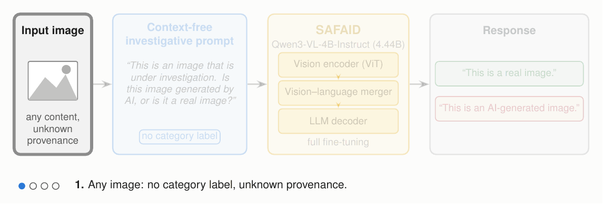
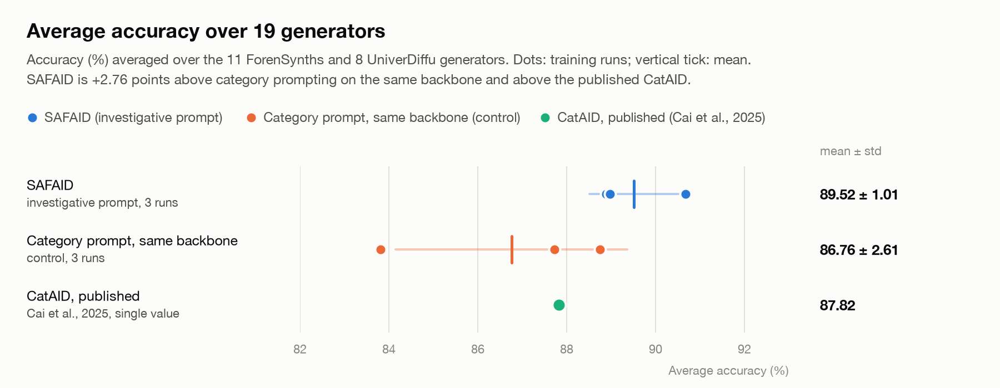
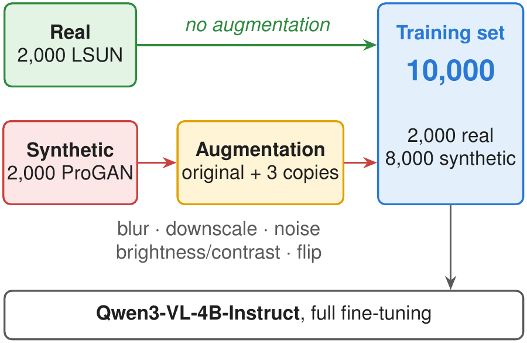
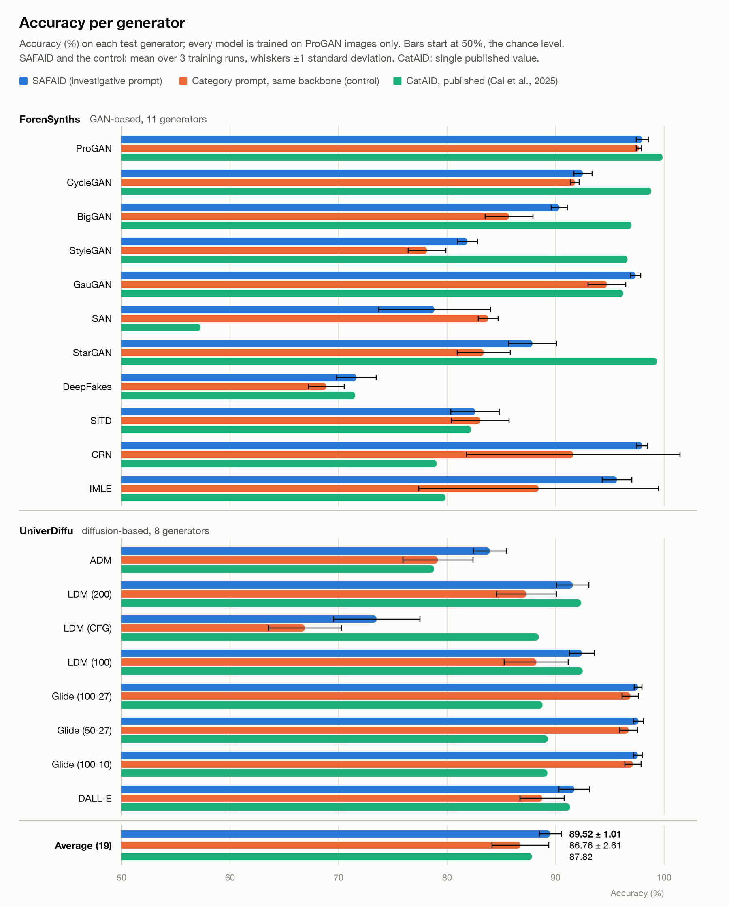
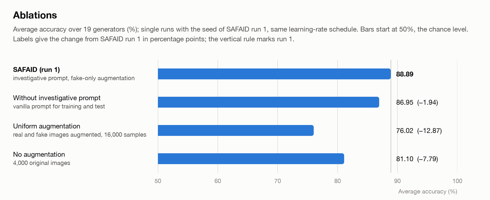
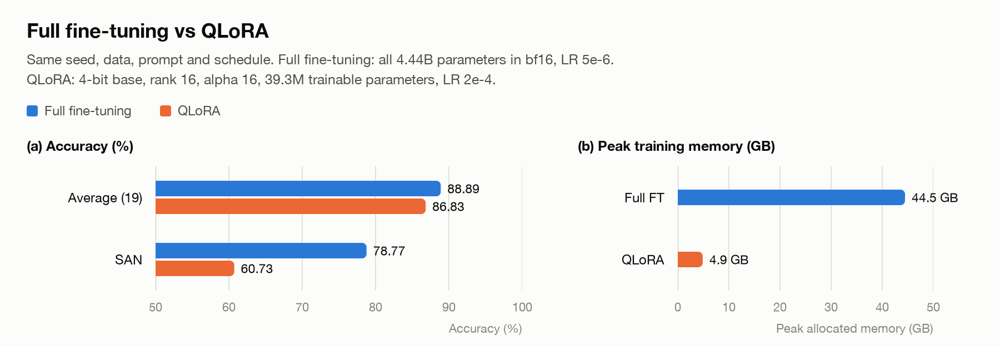
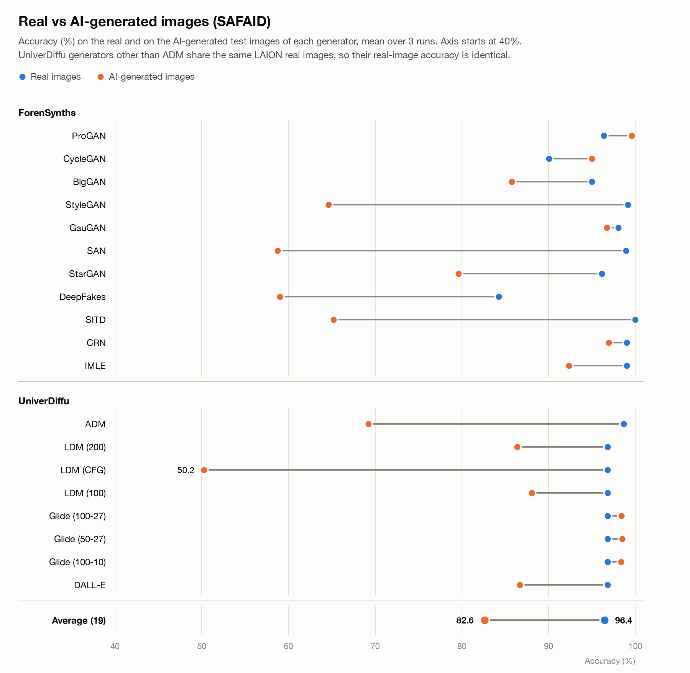
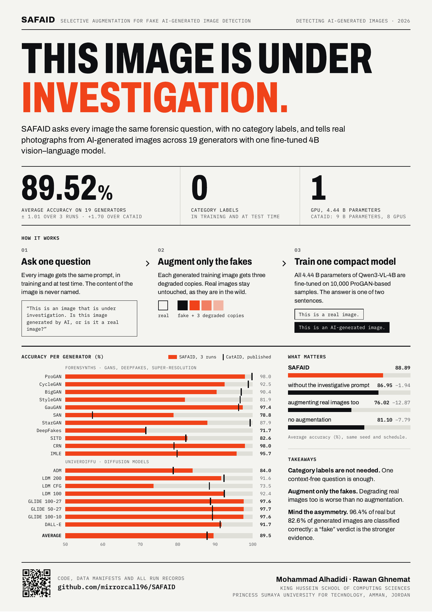

<div align="center">

# SAFAID

### Selective Augmentation for Fake AI-Generated Image Detection

**Category-free detection of AI-generated images with a fully fine-tuned 4B vision–language model, trained on a single GPU.**

[](LICENSE)
[](requirements.txt)
[](requirements.txt)
[](https://huggingface.co/unsloth/Qwen3-VL-4B-Instruct)
[-2ea44f.svg)](#citation)

Mohammad Alhadidi · Rawan Ghnemat<br>
King Hussein School of Computing Sciences, Princess Sumaya University for Technology, Amman, Jordan

</div>

<p align="center"></p>

---

## TL;DR

- **No category labels, ever.** Every image gets the same forensic question, in training and at test time, so SAFAID works on images of unknown content.
- **Selective fake-only augmentation.** Degradations are applied to synthetic training images only; authentic images keep their natural statistics.
- **Compact, single GPU.** Qwen3-VL-4B-Instruct (4.44 B parameters), fully fine-tuned on 10,000 samples built from 4,000 ProGAN images, on **one GPU**. A 4-bit QLoRA variant needs **4.9 GB** of training memory.
- **Strong cross-generator generalisation.** Trained on ProGAN only, tested on **19 GAN and diffusion generators, 18 of them never seen in training** (ForenSynths + UniverDiffu, 82,353 images):

<p align="center">
<picture>
  <source media="(prefers-color-scheme: dark)" srcset="assets/headline_dark.png">
  
</picture>
</p>

| Model | Average accuracy (19 generators) |
|---|---:|
| **SAFAID** (3 training runs) | **89.52 ± 1.01** |
| CatAID, published ([Cai et al., ICCVW 2025](https://openaccess.thecvf.com/content/ICCV2025W/APAI/html/Cai_CatAID_Category-Guided_AI-Generated_Image_Detection_via_Vision-Language_Model_Adaptation_ICCVW_2025_paper.html)) | 87.82 |
| Category-guided prompt on the *same* backbone and recipe (3 runs) | 86.76 ± 2.61 |
| SAFAID with QLoRA (single run) | 86.83 |

Every number in this README is recomputed from the run records in [`results/`](results/) by [`scripts/summarize_results.py`](scripts/summarize_results.py). Each run is listed with its seed, accuracy and files under [Run records](#run-records).

**Contents:** [Method](#method) · [Results](#results) · [Poster](#poster) · [Quick start](#quick-start) · [Reproduce the paper](#reproduce-the-paper) · [Data](#data) · [Evaluation protocol](#evaluation-protocol) · [Transparency notes](#transparency-notes) · [Repository layout](#repository-layout) · [Responsible use](#responsible-use) · [Citation](#citation) · [License](#license)

---

## Method

### 1. Context-free investigative prompting

Category-guided detectors such as CatAID put the image's semantic class into the query (*"This is an image of a cat. …"*). That needs a category label for every training image, and CatAID drops the category at inference anyway. SAFAID asks every image the same question and trains the model to answer with one of two fixed sentences:

| | Text |
|---|---|
| **Prompt** | *This is an image that is under investigation. Is this image generated by AI, or is it a real image?* |
| **Answer (real)** | *This is a real image.* |
| **Answer (fake)** | *This is an AI-generated image.* |

The framing primes the model for forensic scrutiny, stays neutral about content, and is identical in training and deployment.

### 2. Selective fake-only augmentation

Attackers post-process *generated* images to evade detection, while authentic images keep their natural statistics. SAFAID mirrors that asymmetry: each of the 2,000 ProGAN fakes gets **3 stochastically degraded copies**, and the 2,000 real LSUN images stay untouched, for **10,000 training samples** in total.

<p align="center"></p>

> The effective augmentation parameters differ from the ones written in the code, because albumentations 2.x ignores the 1.x argument names. See [Transparency notes](#transparency-notes).

### 3. Full fine-tuning of a compact VLM

All 4.44 B parameters of **Qwen3-VL-4B-Instruct** are fine-tuned with Unsloth:

| Setting | Value |
|---|---|
| Optimiser | AdamW, LR 5e-6, weight decay 0.01, gradient clipping 1.0 |
| Schedule | cosine over 3 epochs (3,750 steps), 10 % warm-up; **evaluated at step 1,600** (1.28 epochs) |
| Batch | 1 × 8 gradient accumulation = 8 |
| Precision | bfloat16 weights, max sequence length 2,048 |
| Hardware | 1 × NVIDIA RTX PRO 6000 Blackwell Server Edition (96 GB) |
| Memory | peak 44.5 GB allocated |

---

## Results

All results below come from ten training runs. Their configurations, logs and metrics are linked one by one under [Run records](#run-records), and the complete tables are in [`results/RESULTS.md`](results/RESULTS.md).

### Accuracy per generator

<p align="center">
<picture>
  <source media="(prefers-color-scheme: dark)" srcset="assets/per_generator_dark.png">
  
</picture>
</p>

<details>
<summary><b>Table: accuracy (%) per generator</b></summary>

| Generator | SAFAID (3 runs) | Category prompt, same backbone (3 runs) | CatAID (published) | SAFAID QLoRA (single run) |
|---|---:|---:|---:|---:|
| ProGAN | 98.00 ± 0.57 | 97.68 ± 0.23 | 99.86 | 97.83 |
| CycleGAN | 92.52 ± 0.84 | 91.78 ± 0.39 | 98.83 | 89.44 |
| BigGAN | 90.36 ± 0.75 | 85.72 ± 2.20 | 97.00 | 88.80 |
| StyleGAN | 81.88 ± 0.92 | 78.16 ± 1.75 | 96.63 | 85.65 |
| GauGAN | 97.38 ± 0.48 | 94.74 ± 1.75 | 96.24 | 95.48 |
| SAN | **78.84 ± 5.14** | 83.79 ± 0.91 | 57.28 | 60.73 |
| StarGAN | 87.88 ± 2.20 | 83.38 ± 2.45 | 99.35 | 82.22 |
| DeepFakes | 71.66 ± 1.83 | 68.88 ± 1.65 | 71.53 | 72.12 |
| SITD | **82.59 ± 2.24** | 83.05 ± 2.65 | 82.22 | 80.83 |
| CRN | **97.98 ± 0.51** | 91.63 ± 9.82 | 79.05 | 77.15 |
| IMLE | 95.67 ± 1.37 | 88.44 ± 11.05 | 79.87 | 78.66 |
| ADM | 83.95 ± 1.53 | 79.17 ± 3.24 | 78.80 | 88.05 |
| LDM (200) | 91.58 ± 1.50 | 87.32 ± 2.76 | 92.35 | 97.00 |
| LDM (CFG) | 73.52 ± 3.99 | 66.90 ± 3.36 | 88.45 | 78.45 |
| LDM (100) | 92.43 ± 1.15 | 88.23 ± 2.95 | 92.50 | 97.00 |
| Glide (100-27) | **97.60 ± 0.36** | 96.90 ± 0.76 | 88.80 | 97.20 |
| Glide (50-27) | **97.65 ± 0.46** | 96.73 ± 0.83 | 89.30 | 97.10 |
| Glide (100-10) | **97.58 ± 0.40** | 97.13 ± 0.75 | 89.25 | 96.85 |
| DALL-E | **91.73 ± 1.41** | 88.77 ± 2.03 | 91.35 | 89.25 |
| **Average (19)** | **89.52 ± 1.01** | 86.76 ± 2.61 | 87.82 | 86.83 |

Mean ± sample standard deviation over three training runs; **bold**: best among SAFAID and the published baselines. CatAID values are from its paper (Table 1). The full table with all baselines, run-by-run values and every run is in [`results/RESULTS.md`](results/RESULTS.md).

</details>

**Highlights**

- **Conditional synthesis:** CRN **+18.93** and IMLE **+15.80** points over CatAID.
- **Super-resolution (SAN):** **+21.56** points over CatAID.
- **Diffusion models, never seen in training:** 97.6 % on all three GLIDE variants, above every baseline.
- **Harder cases:** StyleGAN (its bedroom subset stays at 54–56 %), StarGAN, DeepFakes and LDM with classifier-free guidance.

### Same backbone, different prompt

To separate the prompt from the backbone, the CatAID-style category prompt (*"This is an image of a {category}. Is this image generated by AI, or is it a real image?"*) was trained with **exactly the same recipe** on the same Qwen3-VL-4B, and tested without the category, as CatAID deploys it. SAFAID has the higher mean on **17 of 19 generators** and on average (**+2.76** points). With three runs per side the average gap is not yet statistically significant (Welch's t = 1.71, p ≈ 0.20).

### Ablations

<p align="center">
<picture>
  <source media="(prefers-color-scheme: dark)" srcset="assets/ablations_dark.png">
  
</picture>
</p>

| Configuration (same seed and LR schedule) | Average (19) | Change |
|---|---:|---:|
| **SAFAID** (run 1) | **88.89** | — |
| without the investigative prompt (plain question) | 86.95 | −1.94 |
| uniform augmentation (real *and* fake images) | 76.02 | −12.87 |
| no augmentation | 81.10 | −7.79 |

Augmenting only the fakes is what matters most: applying the same degradations to real images is **worse than no augmentation at all**.

### Full fine-tuning vs QLoRA

<p align="center">
<picture>
  <source media="(prefers-color-scheme: dark)" srcset="assets/qlora_dark.png">
  
</picture>
</p>

With the same data, prompts, augmentation and schedule, 4-bit QLoRA (rank 16, α = 16, all attention and MLP layers, LR 2e-4) reaches **86.83 %** (full fine-tuning with the same seed: 88.89 %) with **9× less training memory** (4.9 GB vs 44.5 GB), so SAFAID also trains on consumer GPUs. Full fine-tuning is the more accurate choice: **+2.06** points on average and **+18.04** on SAN, and it classifies 97.9 % of authentic images correctly, against 94.4 % for QLoRA.

### Real vs AI-generated images

<p align="center">
<picture>
  <source media="(prefers-color-scheme: dark)" srcset="assets/real_vs_fake_dark.png">
  
</picture>
</p>

Averaged over generators and runs, **96.4 %** of authentic and **82.6 %** of AI-generated images are classified correctly. Errors are mostly synthetic images from unseen generators that the model calls real, so a "fake" verdict is strong evidence and a "real" verdict less so.

### Run records

Every number above can be traced to one of these ten runs. The run identifier links to the run's folder in [`results/`](results/).

| Run | What | Seed | Average (19) | Record |
|---|---|---:|---:|---|
| [r11](results/r11_safaid_seed4_qwen3vl4b_fullFT_lr5e-6_ebs8_step1600of3750_notebookAug_rtxpro6000s) | **SAFAID**, run 1 | 4 | 88.89 | [config](results/r11_safaid_seed4_qwen3vl4b_fullFT_lr5e-6_ebs8_step1600of3750_notebookAug_rtxpro6000s/config.json) · [metrics](results/r11_safaid_seed4_qwen3vl4b_fullFT_lr5e-6_ebs8_step1600of3750_notebookAug_rtxpro6000s/metrics_investigative.json) · [training log](results/r11_safaid_seed4_qwen3vl4b_fullFT_lr5e-6_ebs8_step1600of3750_notebookAug_rtxpro6000s/train_log.txt) · [evaluation log](results/r11_safaid_seed4_qwen3vl4b_fullFT_lr5e-6_ebs8_step1600of3750_notebookAug_rtxpro6000s/eval_log_investigative.txt) · [loss curve](results/r11_safaid_seed4_qwen3vl4b_fullFT_lr5e-6_ebs8_step1600of3750_notebookAug_rtxpro6000s/loss.csv) |
| [r3](results/r3_safaid_seed2_qwen3vl4b_fullFT_lr5e-6_ebs8_step1600of3750_notebookAug_rtxpro6000s) | **SAFAID**, run 2 | 2 | 88.98 | [config](results/r3_safaid_seed2_qwen3vl4b_fullFT_lr5e-6_ebs8_step1600of3750_notebookAug_rtxpro6000s/config.json) · [metrics](results/r3_safaid_seed2_qwen3vl4b_fullFT_lr5e-6_ebs8_step1600of3750_notebookAug_rtxpro6000s/metrics_investigative.json) · [training log](results/r3_safaid_seed2_qwen3vl4b_fullFT_lr5e-6_ebs8_step1600of3750_notebookAug_rtxpro6000s/train_log.txt) · [evaluation log](results/r3_safaid_seed2_qwen3vl4b_fullFT_lr5e-6_ebs8_step1600of3750_notebookAug_rtxpro6000s/eval_log_investigative.txt) · [loss curve](results/r3_safaid_seed2_qwen3vl4b_fullFT_lr5e-6_ebs8_step1600of3750_notebookAug_rtxpro6000s/loss.csv) |
| [r4](results/r4_safaid_seed3_qwen3vl4b_fullFT_lr5e-6_ebs8_step1600of3750_notebookAug_rtxpro6000s) | **SAFAID**, run 3 | 3 | 90.68 | [config](results/r4_safaid_seed3_qwen3vl4b_fullFT_lr5e-6_ebs8_step1600of3750_notebookAug_rtxpro6000s/config.json) · [metrics](results/r4_safaid_seed3_qwen3vl4b_fullFT_lr5e-6_ebs8_step1600of3750_notebookAug_rtxpro6000s/metrics_investigative.json) · [training log](results/r4_safaid_seed3_qwen3vl4b_fullFT_lr5e-6_ebs8_step1600of3750_notebookAug_rtxpro6000s/train_log.txt) · [evaluation log](results/r4_safaid_seed3_qwen3vl4b_fullFT_lr5e-6_ebs8_step1600of3750_notebookAug_rtxpro6000s/eval_log_investigative.txt) · [loss curve](results/r4_safaid_seed3_qwen3vl4b_fullFT_lr5e-6_ebs8_step1600of3750_notebookAug_rtxpro6000s/loss.csv) |
| [r2](results/r2_catAIDprompt_seed1_qwen3vl4b_fullFT_lr5e-6_ebs8_step1600of3750_notebookAug_rtxpro6000s) | category prompt, same backbone, run 1 | 1 | 83.81 | [config](results/r2_catAIDprompt_seed1_qwen3vl4b_fullFT_lr5e-6_ebs8_step1600of3750_notebookAug_rtxpro6000s/config.json) · [metrics](results/r2_catAIDprompt_seed1_qwen3vl4b_fullFT_lr5e-6_ebs8_step1600of3750_notebookAug_rtxpro6000s/metrics_vanilla.json) · [training log](results/r2_catAIDprompt_seed1_qwen3vl4b_fullFT_lr5e-6_ebs8_step1600of3750_notebookAug_rtxpro6000s/train_log.txt) · [evaluation log](results/r2_catAIDprompt_seed1_qwen3vl4b_fullFT_lr5e-6_ebs8_step1600of3750_notebookAug_rtxpro6000s/eval_log_vanilla.txt) · [loss curve](results/r2_catAIDprompt_seed1_qwen3vl4b_fullFT_lr5e-6_ebs8_step1600of3750_notebookAug_rtxpro6000s/loss.csv) |
| [r5](results/r5_catAIDprompt_seed2_qwen3vl4b_fullFT_lr5e-6_ebs8_step1600of3750_notebookAug_rtxpro6000s) | category prompt, same backbone, run 2 | 2 | 88.75 | [config](results/r5_catAIDprompt_seed2_qwen3vl4b_fullFT_lr5e-6_ebs8_step1600of3750_notebookAug_rtxpro6000s/config.json) · [metrics](results/r5_catAIDprompt_seed2_qwen3vl4b_fullFT_lr5e-6_ebs8_step1600of3750_notebookAug_rtxpro6000s/metrics_vanilla.json) · [training log](results/r5_catAIDprompt_seed2_qwen3vl4b_fullFT_lr5e-6_ebs8_step1600of3750_notebookAug_rtxpro6000s/train_log.txt) · [evaluation log](results/r5_catAIDprompt_seed2_qwen3vl4b_fullFT_lr5e-6_ebs8_step1600of3750_notebookAug_rtxpro6000s/eval_log_vanilla.txt) · [loss curve](results/r5_catAIDprompt_seed2_qwen3vl4b_fullFT_lr5e-6_ebs8_step1600of3750_notebookAug_rtxpro6000s/loss.csv) |
| [r6](results/r6_catAIDprompt_seed3_qwen3vl4b_fullFT_lr5e-6_ebs8_step1600of3750_notebookAug_rtxpro6000s) | category prompt, same backbone, run 3 | 3 | 87.72 | [config](results/r6_catAIDprompt_seed3_qwen3vl4b_fullFT_lr5e-6_ebs8_step1600of3750_notebookAug_rtxpro6000s/config.json) · [metrics](results/r6_catAIDprompt_seed3_qwen3vl4b_fullFT_lr5e-6_ebs8_step1600of3750_notebookAug_rtxpro6000s/metrics_vanilla.json) · [training log](results/r6_catAIDprompt_seed3_qwen3vl4b_fullFT_lr5e-6_ebs8_step1600of3750_notebookAug_rtxpro6000s/train_log.txt) · [evaluation log](results/r6_catAIDprompt_seed3_qwen3vl4b_fullFT_lr5e-6_ebs8_step1600of3750_notebookAug_rtxpro6000s/eval_log_vanilla.txt) · [loss curve](results/r6_catAIDprompt_seed3_qwen3vl4b_fullFT_lr5e-6_ebs8_step1600of3750_notebookAug_rtxpro6000s/loss.csv) |
| [r16](results/r16_qlora_seed4_qwen3vl4b_qlora4bit_r16a16_lr2e-4_ebs8_step1600of3750_notebookAug_rtxpro6000s) | SAFAID with QLoRA | 4 | 86.83 | [config](results/r16_qlora_seed4_qwen3vl4b_qlora4bit_r16a16_lr2e-4_ebs8_step1600of3750_notebookAug_rtxpro6000s/config.json) · [metrics](results/r16_qlora_seed4_qwen3vl4b_qlora4bit_r16a16_lr2e-4_ebs8_step1600of3750_notebookAug_rtxpro6000s/metrics_investigative.json) · [training log](results/r16_qlora_seed4_qwen3vl4b_qlora4bit_r16a16_lr2e-4_ebs8_step1600of3750_notebookAug_rtxpro6000s/train_log.txt) · [evaluation log](results/r16_qlora_seed4_qwen3vl4b_qlora4bit_r16a16_lr2e-4_ebs8_step1600of3750_notebookAug_rtxpro6000s/eval_log_investigative.txt) · [loss curve](results/r16_qlora_seed4_qwen3vl4b_qlora4bit_r16a16_lr2e-4_ebs8_step1600of3750_notebookAug_rtxpro6000s/loss.csv) |
| [r12](results/r12_ablNoInvestigativePrompt_seed4_qwen3vl4b_fullFT_lr5e-6_ebs8_step1600of3750_notebookAug_rtxpro6000s) | ablation: no investigative prompt | 4 | 86.95 | [config](results/r12_ablNoInvestigativePrompt_seed4_qwen3vl4b_fullFT_lr5e-6_ebs8_step1600of3750_notebookAug_rtxpro6000s/config.json) · [metrics](results/r12_ablNoInvestigativePrompt_seed4_qwen3vl4b_fullFT_lr5e-6_ebs8_step1600of3750_notebookAug_rtxpro6000s/metrics_vanilla.json) · [training log](results/r12_ablNoInvestigativePrompt_seed4_qwen3vl4b_fullFT_lr5e-6_ebs8_step1600of3750_notebookAug_rtxpro6000s/train_log.txt) · [evaluation log](results/r12_ablNoInvestigativePrompt_seed4_qwen3vl4b_fullFT_lr5e-6_ebs8_step1600of3750_notebookAug_rtxpro6000s/eval_log_vanilla.txt) · [loss curve](results/r12_ablNoInvestigativePrompt_seed4_qwen3vl4b_fullFT_lr5e-6_ebs8_step1600of3750_notebookAug_rtxpro6000s/loss.csv) |
| [r13](results/r13_ablUniformAug_seed4_qwen3vl4b_fullFT_lr5e-6_ebs8_step1600of3750steps_uniformAug_rtxpro6000s) | ablation: uniform augmentation | 4 | 76.02 | [config](results/r13_ablUniformAug_seed4_qwen3vl4b_fullFT_lr5e-6_ebs8_step1600of3750steps_uniformAug_rtxpro6000s/config.json) · [metrics](results/r13_ablUniformAug_seed4_qwen3vl4b_fullFT_lr5e-6_ebs8_step1600of3750steps_uniformAug_rtxpro6000s/metrics_investigative.json) · [training log](results/r13_ablUniformAug_seed4_qwen3vl4b_fullFT_lr5e-6_ebs8_step1600of3750steps_uniformAug_rtxpro6000s/train_log.txt) · [evaluation log](results/r13_ablUniformAug_seed4_qwen3vl4b_fullFT_lr5e-6_ebs8_step1600of3750steps_uniformAug_rtxpro6000s/eval_log_investigative.txt) · [loss curve](results/r13_ablUniformAug_seed4_qwen3vl4b_fullFT_lr5e-6_ebs8_step1600of3750steps_uniformAug_rtxpro6000s/loss.csv) |
| [r14](results/r14_ablNoAug_seed4_qwen3vl4b_fullFT_lr5e-6_ebs8_step1600of3750steps_noAug_rtxpro6000s) | ablation: no augmentation | 4 | 81.10 | [config](results/r14_ablNoAug_seed4_qwen3vl4b_fullFT_lr5e-6_ebs8_step1600of3750steps_noAug_rtxpro6000s/config.json) · [metrics](results/r14_ablNoAug_seed4_qwen3vl4b_fullFT_lr5e-6_ebs8_step1600of3750steps_noAug_rtxpro6000s/metrics_investigative.json) · [training log](results/r14_ablNoAug_seed4_qwen3vl4b_fullFT_lr5e-6_ebs8_step1600of3750steps_noAug_rtxpro6000s/train_log.txt) · [evaluation log](results/r14_ablNoAug_seed4_qwen3vl4b_fullFT_lr5e-6_ebs8_step1600of3750steps_noAug_rtxpro6000s/eval_log_investigative.txt) · [loss curve](results/r14_ablNoAug_seed4_qwen3vl4b_fullFT_lr5e-6_ebs8_step1600of3750steps_noAug_rtxpro6000s/loss.csv) |

- **Seed and settings:** `config.json` holds the seed, prompts, augmentation mode, effective augmentation parameters, library versions, hardware and timings of the run; `training_args.json` holds the effective Trainer arguments.
- **Accuracy:** `metrics_<prompt>.json` holds the accuracy, real and fake accuracy and confusion counts of each of the 19 generators, plus the 19-generator average.
- **Training:** `train_log.txt`, `loss.csv` and `trainer_state.json` record the whole training run step by step.
- **Per-image predictions:** [`results/predictions.zip`](results/predictions.zip) contains the model's answer for every test image of every run (82,353 per run).
- **All tables in one place:** [`results/RESULTS.md`](results/RESULTS.md) has the run overview, run-by-run accuracy per generator, the ablation and QLoRA tables and the consistency checks. `python scripts/summarize_results.py --out results/RESULTS.md` rebuilds it from the run folders and re-checks every accuracy against the per-image predictions.

SAFAID runs 1 to 3 give the mean ± standard deviation reported above. The three ablations and the QLoRA run use the seed of SAFAID run 1 and are compared with that run.

---

## Poster

<p align="center"><a href="assets/poster.pdf"></a></p>

Poster of the method and results (A3 artwork, scales to A1 or A0 for printing): [`assets/poster.pdf`](assets/poster.pdf). `bash poster/build.sh` regenerates it from the same run records ([`poster/`](poster/)).

---

## Quick start

Score your own images with a trained checkpoint (see [Model weights](#model-weights)):

```python
from PIL import Image
from unsloth import FastVisionModel
from transformers import AutoProcessor

ckpt = "path/to/checkpoint-1600"
model, _ = FastVisionModel.from_pretrained(ckpt, load_in_16bit=True)
FastVisionModel.for_inference(model)
processor = AutoProcessor.from_pretrained(ckpt)

prompt = "This is an image that is under investigation. Is this image generated by AI, or is it a real image?"
messages = [{"role": "user", "content": [{"type": "image", "image": Image.open("photo.png").convert("RGB")},
                                         {"type": "text", "text": prompt}]}]
inputs = processor.apply_chat_template(messages, tokenize=True, add_generation_prompt=True,
                                       return_dict=True, return_tensors="pt").to(model.device)
out = model.generate(**inputs, max_new_tokens=50, do_sample=False)
print(processor.decode(out[0][inputs["input_ids"].shape[1]:], skip_special_tokens=True))
# -> "This is a real image."  or  "This is an AI-generated image."
```

For whole folders, use `safaid/eval.py` with your own manifest in the format of [`manifests/eval_members_manifest.csv`](manifests/eval_members_manifest.csv).

---

## Reproduce the paper

**Cost:** one run (training plus evaluation of all 82,353 test images) takes about two hours on one RTX PRO 6000, about **$3** on vast.ai at ~$1.50/h.

```bash
# 1. Rent a GPU. We used vast.ai: 1x RTX PRO 6000 Blackwell (96 GB), image
#    vastai/pytorch:2.9.1-cuda-12.8.1-py312-24.04, 250 GB disk.
git clone https://github.com/mirrorcall96/SAFAID.git /workspace/safaid-release && cd /workspace/safaid-release

# 2. Pinned environment + base model at a fixed revision (keeps the image's torch 2.9.1+cu128)
bash scripts/setup.sh

# 3. Data: training subset by HTTP range reads (SHA256-verified), ForenSynths test set, UniverDiffu
python safaid/fetch_data.py
python scripts/verify_data.py            # optional: re-checks every file against the manifests

# 4. Run the experiments (train -> eval, resumable)
tmux new -d -s queue "bash scripts/queue.sh  > /workspace/safaid/logs/queue.log  2>&1"   # SAFAID and control runs
tmux new -d -s queue "bash scripts/queue2.sh > /workspace/safaid/logs/queue2.log 2>&1"   # QLoRA and ablations

# 5. Tables
python scripts/summarize_results.py --out results/RESULTS.md
```

### The ten runs

The records of these runs (configuration, logs, metrics) are linked under [Run records](#run-records).

| Run | What | `train.py` flags | Seed | Test prompt |
|---|---|---|---|---|
| r11, r3, r4 | **SAFAID**, runs 1–3 | (defaults) | 4, 2, 3 | investigative |
| r2, r5, r6 | category-guided prompt, same backbone, 3 runs | `--train_prompt category` | 1, 2, 3 | vanilla |
| r16 | QLoRA | `--method qlora` | 4 | investigative |
| r12 | ablation: no investigative prompt | `--train_prompt vanilla` | 4 | vanilla |
| r13 | ablation: uniform augmentation | `--aug_mode uniform --schedule_steps 3750` | 4 | investigative |
| r14 | ablation: no augmentation | `--aug_mode none --schedule_steps 3750` | 4 | investigative |

All runs use `--stop_step 1600` and take the seed from `--seed`. The ablations and the QLoRA run share the seed of SAFAID run 1. `--schedule_steps 3750` keeps the learning-rate curve identical for ablations with a different number of samples.

<details>
<summary><b>Single runs, paths and the optional laptop-side watcher</b></summary>

```bash
python safaid/train.py --run_name safaid_run1 --seed 4
python safaid/eval.py  --model_path $SAFAID_RUNS/safaid_run1/model/checkpoint-1600 \
                       --run_dir $SAFAID_RUNS/safaid_run1 --test_prompt investigative
python safaid/eval.py  ... --limit_per_row 20        # smoke test: 20 images per label per row
```

| Variable | Default | Used by |
|---|---|---|
| `SAFAID_WORKDIR` | `/workspace/safaid` | all scripts (holds `data/`, `runs/`, `logs/`) |
| `SAFAID_DATA` | `$SAFAID_WORKDIR/data` | `fetch_data.py`, `train.py`, `eval.py`, `verify_data.py` |
| `SAFAID_RUNS` | `$SAFAID_WORKDIR/runs` | `train.py`, queue scripts |
| `SAFAID_MANIFESTS` | `<repo>/manifests` | all Python scripts |
| `SAFAID_AUTOSTOP_MIN` | `45` | queue scripts: on vast.ai the instance stops itself this many minutes after the queue ends unless the watcher is alive; `0` disables it |

`scripts/watch_vast.sh` runs on your laptop through the `vastai` CLI (logged in with your own key). Every 60 s it syncs the run folders, logs GPU, disk and credit, downloads each trained checkpoint, stops the instance if credit runs low, and destroys it once everything is downloaded, verifying every stop or destroy against the API.

```bash
export SAFAID_SSH_HOST=root@<ip> SAFAID_SSH_OPTS="-p <port> -i $HOME/.ssh/<key>"
nohup bash scripts/watch_vast.sh <instance_id> >> watcher.log 2>&1 &     # macOS: caffeinate -i bash ...
```

</details>

**Measured timings (RTX PRO 6000, three vast.ai hosts):** training 1,600 steps takes 38–52 min depending on the host (1.4–1.96 s/step; QLoRA 71 min); evaluation of 82,353 images takes 63–75 min, of which SITD (360 very large images at batch 2) takes 30–35 min; batched inference runs at 40–60 images/s on 256 × 256 test sets. Per-run values are in [`results/RESULTS.md`](results/RESULTS.md).

---

## Data

| Data | Used for | Source (pinned) | License |
|---|---|---|---|
| ProGAN training set, CNNDetection ([Wang et al., CVPR 2020](https://github.com/PeterWang512/CNNDetection)) | 4,000-image training subset | HF [`sywang/CNNDetection`](https://huggingface.co/datasets/sywang/CNNDetection) @ `f287cf3c` | CC BY-NC-SA 4.0 |
| ForenSynths test set, `CNN_synth_testset.zip` (20.1 GB) | 11 ForenSynths generators | same repo @ `f287cf3c` | CC BY-NC-SA 4.0 |
| UniverDiffu, `diffusion_datasets.zip` (918 MB) ([Ojha et al., CVPR 2023](https://github.com/WisconsinAIVision/UniversalFakeDetect)) | 8 diffusion generators | Google Drive file linked from the UniversalFakeDetect README | reals from LAION / ImageNet, own terms |
| Qwen3-VL-4B-Instruct | base model | HF `unsloth/Qwen3-VL-4B-Instruct` @ `252d592b` | Apache-2.0 |

- **Training subset without the 75 GB download.** The HF release stores the ProGAN training set as a store-mode 7z around one zip. [`manifests/scripts/multipart.py`](manifests/scripts/multipart.py) exposes the 7 volumes as one seekable byte range, and `fetch_data.py` range-reads each of the 4,000 files, checks the zip's **CRC32** and the manifest's **SHA256**, and only then writes it: 414 MB in ~37 s.
- **How the subset was chosen.** [`make_subset_v2.py`](manifests/scripts/make_subset_v2.py) draws 100 real + 100 fake images per LSUN category with a fixed seed, from files that are unique in the training zip and absent from the validation and test zips (no train/test leakage). Re-running it reproduces the shipped CSVs byte for byte; see [`manifests/README.md`](manifests/README.md).
- **Test sets** are used in full; `scripts/verify_data.py` checks every extracted image against size and CRC32 from the zips' central directories.

---

## Evaluation protocol

- **All images, no subsampling:** 72,353 ForenSynths images (including the StyleGAN bedroom subset, all 438 SAN images and SITD at native resolution) and 10,000 UniverDiffu images.
- **UniverDiffu pairing** follows UniversalFakeDetect: ADM (`guided`) is scored with the 1,000 ImageNet reals, every LDM, Glide and DALL-E variant with the 1,000 LAION reals.
- **Inference:** 16-bit model, left padding, chat template, greedy decoding (`max_new_tokens=50`), batch 128 (SAN 32, SITD 2).
- **Parsing:** an answer containing `ai-generated`, `ai generated` or `fake` is *fake*; otherwise `real` is *real*; anything else is an error.
- **Metric:** per generator, accuracy = (TP + TN) / (N_real + N_fake); **Average (19)** is the unweighted mean over the 19 generators.

---

## Transparency notes

<details open>
<summary><b>Augmentation parameters actually in effect</b></summary>

`safaid/train.py` keeps the original notebook's augmentation code, written with **albumentations 1.x argument names**. albumentations 2.0.8 ignores those arguments with a warning, so three transforms ran with their 2.x defaults. This applies to every result here:

| Transform (p) | Written in the code | **Effective with albumentations 2.0.8** |
|---|---|---|
| HorizontalFlip (0.5) | flip | flip |
| ImageCompression (0.4) | JPEG quality 30–95 | **JPEG quality 99–100** (almost lossless) |
| GaussianBlur (0.3) | kernel 3–7 | kernel 3–7 |
| Downscale (0.2) | scale 0.5–0.9 | **fixed scale 0.25** |
| RandomBrightnessContrast (0.2) | ±10 % | ±10 % |
| GaussNoise (0.1) | variance 10–30 | **std 0.20–0.44 of the intensity range** |

`git apply patches/intended_augmentation.patch` switches to the intended parameters with 2.x names. That configuration has not been trained yet, so expect different numbers.

</details>

- **Checkpoint:** all numbers are from step 1,600 of the 3-epoch schedule, the checkpoint used throughout the paper.
- **Runs:** the three SAFAID runs use different seeds (listed in [`results/RESULTS.md`](results/RESULTS.md)); they share one training subset and one data order (Unsloth's default data seed) and differ in the augmented copies and other random state.
- **Baselines:** numbers for methods other than SAFAID and the same-backbone control are taken from the CatAID paper (Table 1).
- **Not in this release yet:** DF³ robustness results for the three runs (the dataset is available on request from the [GLFF authors](https://github.com/littlejuyan/GLFF)) and the post-cutoff contamination test ([`contamination/`](contamination/), pending).

---

## Repository layout

```
safaid/
  train.py              full fine-tuning or QLoRA; prompt, augmentation mode, seed, stop step
  eval.py               batched evaluation on all Table 1 images -> preds + metrics
  fetch_data.py         training subset by HTTP range reads (CRC32 + SHA256), test sets
scripts/
  setup.sh              pinned environment + base model at a fixed revision
  queue.sh, queue2.sh   the ten runs, train -> eval, resumable
  watch_vast.sh         optional laptop-side watcher: sync, downloads, verified stop/destroy
  verify_data.py        re-checks the data on disk against the manifests
  summarize_results.py  rebuilds results/RESULTS.md from the run folders
  score_predictions.py  scores a predictions CSV against the manifest
contamination/          post-cutoff contamination test (new generators + recent real photos), pending
manifests/              training/val subsets (+ SHA256), evaluation member list, zip checksums, selection scripts
results/                per-run records of the ten runs, RESULTS.md, predictions.zip
assets/                 figures, charts, animated pipeline and poster (make_charts.py regenerates the charts,
                        src/make_animation.sh the animation)
poster/                 poster source: make_poster.py (HTML page from results/) and build.sh (PDF and PNG)
patches/                intended_augmentation.patch
env/pip_freeze.txt      full environment of the training machine
```

Each run folder in `results/` holds `config.json` (all settings, effective augmentation, versions, timings), `training_args.json` (the effective Trainer arguments), `trainer_state.json`, `loss.csv`, `metrics_<prompt>.json` and the logs. [`results/predictions.zip`](results/predictions.zip) contains every per-image prediction (82,353 per run).

### Model weights

The fine-tuned checkpoints (~8.9 GB each) are not hosted here. They are available from the corresponding author on reasonable request.

---

## Responsible use

AI-image detectors are dual-use: a released detector or training recipe can help adversaries probe for blind spots. SAFAID's errors are asymmetric (96.4 % of authentic vs 82.6 % of AI-generated images correct on average), and it outputs a hard decision without calibrated confidence. Use it to **support, not replace, human verification**, and not as stand-alone evidence about a person.

---

## Citation

The entry will be updated on publication.

```bibtex
@misc{alhadidi2026safaid,
  title  = {{SAFAID}: Selective Augmentation for Fake {AI}-Generated Image Detection},
  author = {Alhadidi, Mohammad and Ghnemat, Rawan},
  year   = {2026},
  note   = {Manuscript under revision at the International Journal of Computer Vision},
  url    = {https://github.com/mirrorcall96/SAFAID}
}
```

Please also cite the datasets ([CNNDetection](https://github.com/PeterWang512/CNNDetection), [UniversalFakeDetect](https://github.com/WisconsinAIVision/UniversalFakeDetect)) and, when comparing against it, [CatAID](https://openaccess.thecvf.com/content/ICCV2025W/APAI/html/Cai_CatAID_Category-Guided_AI-Generated_Image_Detection_via_Vision-Language_Model_Adaptation_ICCVW_2025_paper.html).

## License

Code: [MIT](LICENSE). The datasets and the base model are **not** redistributed and keep their own licenses (CNNDetection / ForenSynths: CC BY-NC-SA 4.0; Qwen3-VL-4B-Instruct: Apache-2.0; UniverDiffu reals: LAION / ImageNet terms). `manifests/` only lists file names and checksums.

## Acknowledgements

This work was carried out at Princess Sumaya University for Technology without external funding. It builds on [Unsloth](https://github.com/unslothai/unsloth), [Albumentations](https://github.com/albumentations-team/albumentations), [CNNDetection](https://github.com/PeterWang512/CNNDetection) and [UniversalFakeDetect](https://github.com/WisconsinAIVision/UniversalFakeDetect).
